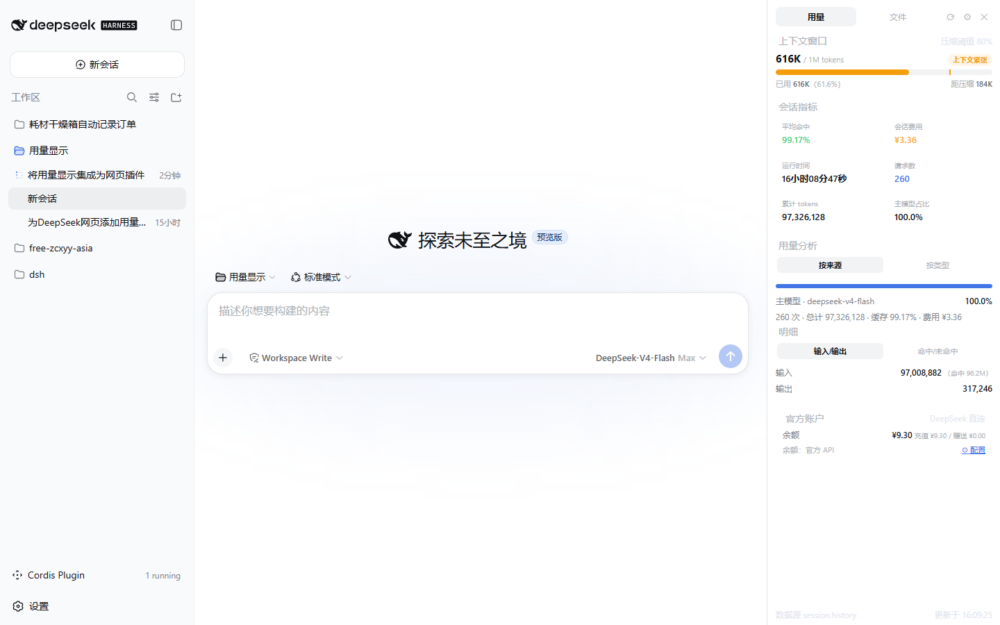
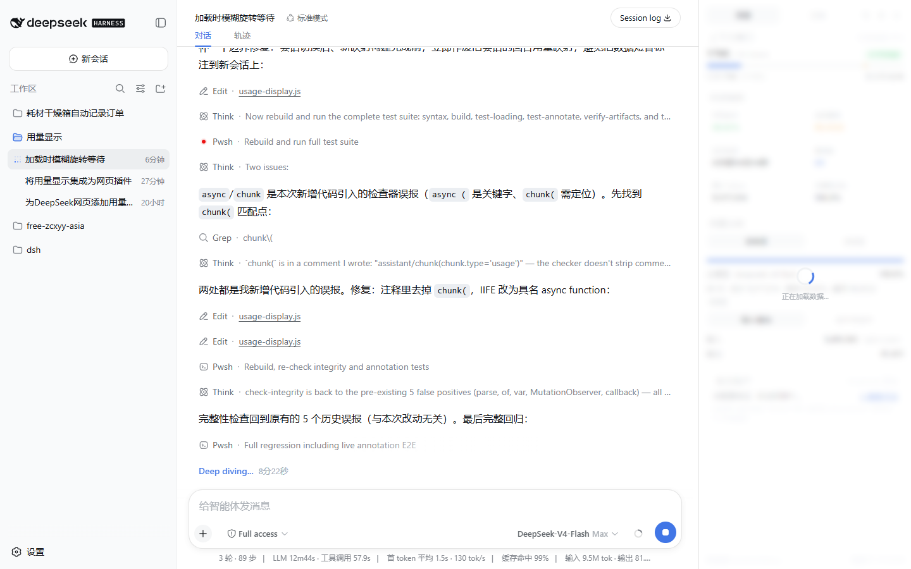
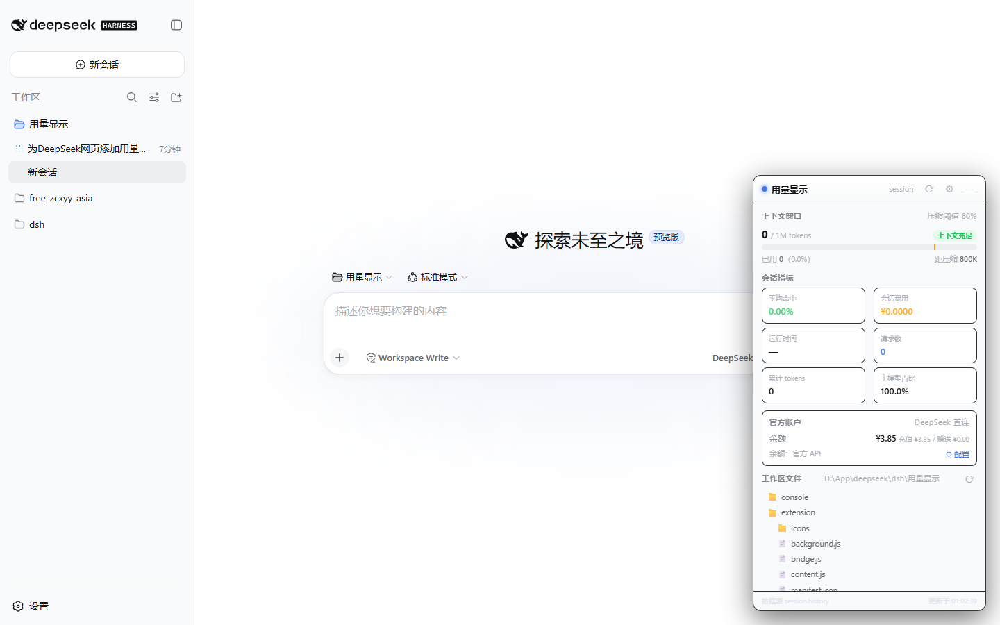
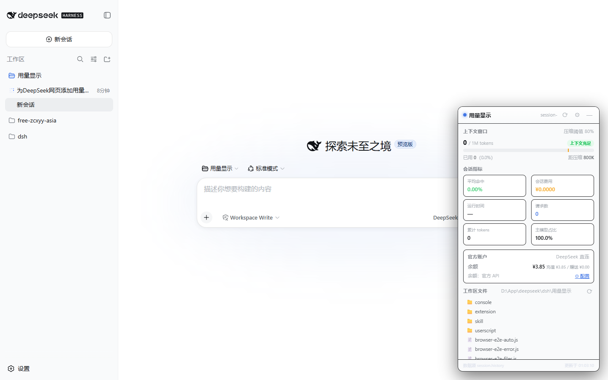
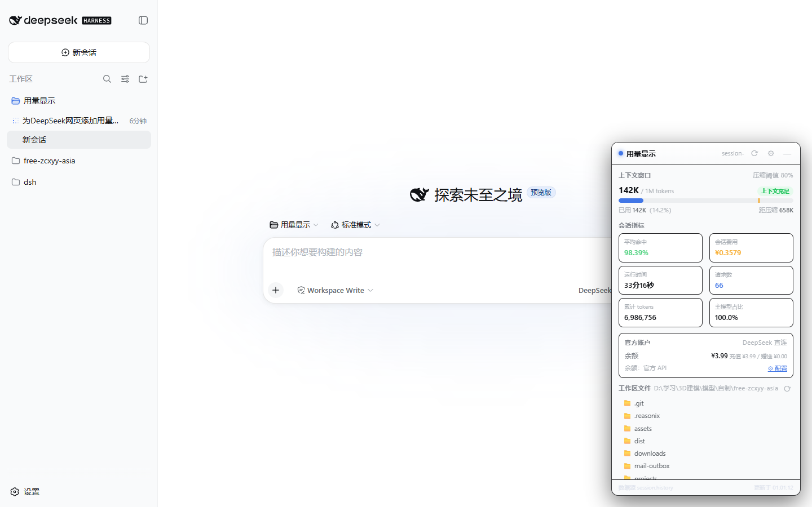

# DSH 用量显示 · Usage Display for DeepSeek Harness

在 [DeepSeek Harness](https://github.com/deepseek-ai/DeepSeek-Harness) Web GUI（`http://127.0.0.1:3080`）中显示当前会话的 **token 用量 / 上下文占用 / 缓存命中率 / 费用估算 / 请求数**，附带工作区文件浏览与 DeepSeek 官方账户余额查询。原生观感、跟随主题、数据全部来自 DSH 宿主自身，**零依赖、无构建、不改 DSH 仓库**。

> 本仓库为**自包含发行版**：所有可执行产物（油猴脚本 / 扩展 / 控制台脚本 / DSH 动态插件）均已生成并随仓库分发，克隆后可直接使用，无需任何构建步骤。

---

## 目录

- [功能特性](#功能特性)
- [截图](#截图)
- [两种路线：注入脚本 vs DSH 动态插件](#两种路线注入脚本-vs-dsh-动态插件)
- [快速开始（人类 · 5 分钟）](#快速开始人类--5-分钟)
- [AI / Agent 部署手册（发给 DeepSeek 即可执行）](#ai--agent-部署手册发给-deepseek-即可执行)
- [数据来源与口径](#数据来源与口径)
- [配置](#配置)
- [开发与测试](#开发与测试)
- [目录结构](#目录结构)
- [安全与隐私](#安全与隐私)
- [License](#license)

---

## 功能特性

| 区块 | 内容 |
|---|---|
| 上下文窗口 | 已用 / 窗口（1M）、压缩阈值（默认 80%）、距压缩余量、状态徽标（充足/紧张/到阈值） |
| 会话指标 | 平均命中率、会话费用（Reasonix 同款价目表本地估算）、运行时间、请求数、累计 tokens |
| 用量分析 | 按来源（主模型 / 子代理）· 按类型（输入 / 输出）切换 |
| 明细 | 输入/输出、命中/未命中 双视图 |
| 聊天区标注 | 每条已完成回合（turn）底部、复制按钮旁自动标注 `↑输入 · ↓输出 · ¥费用` |
| 工作区文件 | 当前会话 cwd 目录树（点击展开）、文本预览（≤500KB / 2 万字符）、系统打开 |
| 官方账户 | API Key 直连 `api.deepseek.com/user/balance` 查真实余额；平台 userToken 查官方今日/本月费用与用量 |
| 加载反馈 | 请求期间模糊遮罩 + 旋转指示；切换会话立即刷新 |
| 主题跟随 | 全部使用 DSH 语义 CSS 变量（`--dsw-*`），亮/暗主题自动切换 |

---

## 截图

| 主面板 | 聊天区标注 |
|---|---|
|  |  |

| 文件视图 | 主题跟随（暗） | 主题跟随（亮） | 一键导入 |
|---|---|---|---|
|  |  |  |  |

---

## 两种路线：注入脚本 vs DSH 动态插件

| | 注入脚本（油猴 / 扩展 / 控制台） | DSH 动态插件（`dsh-plugin/`，原生嵌入） |
|---|---|---|
| 修改 DSH 仓库 | 不需要 | 不需要（进程内临时扩展，代码在插件包内） |
| 服务器重启 | 不需要 | 不需要；DSH 进程重启后插件需重新安装（JSON 还在，一句话重装） |
| 构建工具链 | 无（纯 JS） | 无（纯 JS，无构建） |
| 升级 DSH 后 | 不受影响 | 不受影响（不落盘） |
| 部署方式 | 用户在浏览器手动操作 | **Agent 在会话里用 `cordis_define` / `cordis_run` 工具完成，全程无需手动操作** |
| 卸载 | `__DSH_USAGE_DISPLAY.destroy()` / 刷新页面 | 会话里 `cordis_stop` / `cordis_undefine` |
| 数据 | 同源 `session.history` 投影（页面 API） | 宿主服务直读（sessionQuery / subagents / fs），口径一致 |
| 官方余额/费用 | Key 存浏览器 localStorage；CORS 限制形态差异 | 凭证仅会话内存；宿主 curl 直连官方，不受页面 CORS 限制 |

> 二者能力对等，可同时使用（互不干扰）。**AI/Agent 推荐走动态插件路线**（见下），因为它是唯一不需要用户手动操作浏览器的路线。

---

## 快速开始（人类 · 5 分钟）

前提：DSH Web GUI 已在 `http://127.0.0.1:3080` 运行。任选一种：

### 方式 ① Tampermonkey 油猴脚本（最简单）

1. 浏览器安装 [Tampermonkey](https://www.tampermonkey.net/)。
2. 打开本仓库的 `userscript/用量显示.user.js` → Tampermonkey 自动弹出安装页 → 点"安装"。
3. 刷新 DSH 网页，右侧出现用量面板。

### 方式 ② Chrome/Edge 扩展（最稳定）

1. 浏览器打开 `chrome://extensions`（Edge：`edge://extensions`），开启"开发者模式"。
2. 点"加载已解压的扩展程序" → 选择本仓库的 `extension/` 目录。
3. 刷新 DSH 网页。匹配 `http://127.0.0.1/*`、`http://localhost/*` 任意端口。

### 方式 ③ 控制台粘贴（临时 · 免安装）

1. DSH 网页按 F12 → Console。
2. 粘贴 `console/用量显示-控制台注入.js` 全部内容，回车。
3. 移除：`__DSH_USAGE_DISPLAY.destroy()`（恢复页面布局）或刷新页面。

### 方式 ④ DSH 动态插件（原生嵌入，推荐给 Agent 执行）

见下一节"AI / Agent 部署手册"——它就是为这个路线写的。

---

## AI / Agent 部署手册（发给 DeepSeek 即可执行）

> **给 AI 的说明**：你是部署 Agent。请按以下步骤**逐条执行**，每一步都有"验证点"（必须确认通过再进入下一步）。目标：把本仓库的用量显示面板**嵌入到 DSH（DeepSeek Harness Web GUI）**。本手册的完整版见 `docs/AGENT-GUIDE.md`。

### 第 0 步 · 前置检查（全部通过才继续）

```bash
# ① DSH Web GUI 在线？
curl -s -o /dev/null -w "%{http_code}" http://127.0.0.1:3080/        # 期望 200
# ② Node.js 可用？（仅扩展/本地桥/测试需要，纯插件路线可跳过）
node -v                                                                # 期望 v18+
# ③ 代码就位？
ls usage-display.js dsh-plugin/usage-display.plugin.json              # 期望 4 个路径都存在
```

### 第 1 步 · 选择部署形态（决策）

| 你的约束 | 选择 |
|---|---|
| 用户不手动操作浏览器，由你（Agent）全程完成 | **路线 A：DSH 动态插件**（推荐，见第 2 步） |
| 用户愿意装浏览器扩展，想要最稳定的持久方案 | 路线 B：Chrome/Edge 扩展（`extension/` 目录） |
| 用户愿意装油猴，想要最简单 | 路线 C：油猴脚本（`userscript/用量显示.user.js`） |
| 临时用一下，什么都不装 | 路线 D：控制台粘贴（`console/用量显示-控制台注入.js`） |

### 第 2 步 · 路线 A：嵌入 DSH 动态插件（推荐，核心目标）

**A-1. 读取插件包**：读取文件 `dsh-plugin/usage-display.plugin.json`。它是一个 JSON，`code.host` 与 `code.client` 是两个字符串（分别是插件 Host 半与 Client 半的代码）。

**A-2. 定义并激活插件**：在当前 DSH 会话中，调用工具 `cordis_define`：

- `kind: "new"`，`idPrefix: "usgdp"`，`code.host` / `code.client` 使用插件 JSON 中对应字段的值。

定义成功后调用 `cordis_run` 激活。

**A-3. 验证（必须全部通过）**：

- 面板出现在 DSH 页面（右下角或右侧列，取决于你的 DSH 版本布局；若页面未刷新，可提示用户刷新一次）。
- 面板显示"上下文窗口 / 已用 / 命中率 / 费用"等数据（数据随会话投影实时更新，无需额外配置）。

> 若 A-2 失败：确认你调用的工具名是 `cordis_define`（有些环境写作 `cordis_define` 工具而非聊天指令），并把 `usage-display.plugin.json` 的完整内容作为输入。插件是**进程级临时扩展**：DSH 重启后需重新执行 A-1～A-2（代码都在 JSON 里，一条消息即可重装）。

**A-4（可选增强）激活宿主内建桥**：读取 `dsh-plugin/host-bridge.js`，用其内容调用 `cordis_define`（`idPrefix: "dshub"`）再 `cordis_run`。激活后宿主在 3080 注册同源路由：

```bash
curl -s http://127.0.0.1:3080/dshu/ping        # 期望 {"ok":true}
curl -s "http://127.0.0.1:3080/dshu/tree?path=C%3A%5C"   # 期望 JSON 目录列表
```

桥的作用：注入脚本（扩展/油猴/控制台）无需本地桥即可用文件浏览 + 自动读取宿主 API Key 查官方余额。

### 第 3 步 · 路线 B/C/D（用户手动，Agent 指导）

| 路线 | 用户操作 | Agent 验证 |
|---|---|---|
| B 扩展 | `chrome://extensions` → 开发者模式 → 加载已解压 → 选 `extension/` | 刷新页面后 F12 Console 无报错，面板出现 |
| C 油猴 | 打开 `userscript/用量显示.user.js` → 安装 → 刷新 | 同上 |
| D 控制台 | F12 → Console → 粘贴 `console/用量显示-控制台注入.js` | 面板出现；`__DSH_USAGE_DISPLAY.destroy()` 可卸载 |

### 第 4 步 · 官方余额（可选，免粘贴）

1. **优先**：已激活宿主桥（A-4）→ 面板自动读取宿主凭证（`DEEPSEEK_API_KEY`，即 DSH 自己的凭证文件，一般位于 `~/.dsh/.credentials.yaml`），无需任何操作。
2. 无宿主桥时：运行 `node setup-key.js`（或双击 `setup-key.bat`）→ 自动从常见凭证位置读取 Key，在 `127.0.0.1:3987` 提供一次性导入服务，面板数秒内自动导入并关闭服务。
3. 面板 ⚙ → 余额即时显示；要官方费用（今日/本月）需在 `platform.deepseek.com` 登录后复制 `userToken` 粘贴保存（仅扩展/油猴版支持，平台接口拦截页面直连）。

### 第 5 步 · 验收清单

- [ ] 面板显示当前选中会话的数据，且跟随会话切换
- [ ] `[用量 | 文件]` 视图可切换，文件树可展开、文本可预览
- [ ] 颜色跟随 DSH 亮/暗主题
- [ ] 聊天区每个已完成回合底部有 `↑输入 · ↓输出 · ¥费用` 标注
- [ ] 卸载测试：插件路线 `cordis_stop`；注入路线 `__DSH_USAGE_DISPLAY.destroy()` 或刷新页面

### 故障排查速查

| 现象 | 处理 |
|---|---|
| 面板不出现 | 确认页面是 `http://127.0.0.1:3080`；刷新页面；F12 Console 看 `[用量显示]` 日志（可设 `CONFIG.debug=true`） |
| 显示"等待会话数据" | 页面还没选定会话，等 5 秒自动重试 |
| 显示"加载失败" | 确认 DSH 服务在运行；插件路线确认 `cordis_run` 成功 |
| 插件激活后无面板 | 让用户刷新一次页面（Client 半在页面加载后挂载） |
| 数字对不上 | 确认面板会话与 GUI 选中会话一致 |

---

## 数据来源与口径

全部数据来自**页面同源 API / DSH 宿主自身**，无外部请求（官方余额/费用除外，仅发往 DeepSeek 官方域名）：

- `POST /api/session.history`（分页，含服务端 `projections`）：
  - `tokenUsage` → 累计输入/输出/缓存命中（**服务端 token-meter 实时折叠，权威值**）
  - `contextPressure` → 上下文窗口、当前占用投影 → **已用 / 距压缩**
  - `contextBreakdown`、`sessionStats` → 上下文构成、耗时等
- `POST /api/subagent.list` + `subagent.history` → 按来源统计子代理用量
- 当前会话 id：`localStorage["dsh.sessions.current"]`（与 GUI 同一存储键）

准确性分层（诚实说明）：

| 数字 | 来源 | 性质 |
|---|---|---|
| 余额 ¥xx.xx | 官方 `api.deepseek.com/user/balance` | **官方准确值** |
| 今日/本月费用、tokens、请求数 | 官方 `platform.deepseek.com/api/v0/usage/*` | **官方准确值**（需 userToken） |
| 会话级 tokens / 命中率 / 上下文 | DSH 宿主 token-meter 投影 | **宿主权威值** |
| 会话费用（单会话） | token × 价目表（Reasonix 同款） | 本地估算（官方没有按会话计费的接口） |

> **为什么会话费用是"本地估算"？** 整条链路（DeepSeek API → DSH 宿主）只返回 token 计数，从不返回金额。价目表内置 Reasonix 开源仓库同款（`src/telemetry/stats.ts` 的 `DEEPSEEK_PRICING`）：
>
> | 模型 | 命中输入 | 未命中输入 | 输出 | 上下文窗口 |
> |---|---|---|---|---|
> | deepseek-v4-flash / chat / reasoner | $0.0028/M | $0.14/M | $0.28/M | 1M |
> | deepseek-v4-pro | $0.003625/M | $0.435/M | $0.87/M | 1M |
>
> 面板自动从会话事件识别实际模型（`assistant/message` 的 `source.model`），默认按 ¥ 显示（USD × 7.14）。

---

## 配置

打开 `usage-display.js` 顶部 `CONFIG`：

```js
const CONFIG = {
  pricing: {                    // USD/1M tokens，与 Reasonix DEEPSEEK_PRICING 一致
    'deepseek-v4-flash': { cacheHit: 0.0028, cacheMiss: 0.14, output: 0.28 },
    'deepseek-v4-pro':   { cacheHit: 0.003625, cacheMiss: 0.435, output: 0.87 },
    fallback:            { cacheHit: 0.0028, cacheMiss: 0.14, output: 0.28 },
  },
  currency: 'CNY',        // 'CNY'（¥，USD×cnyRate）或 'USD'（$）
  cnyRate: 7.14,          // USD→CNY 汇率
  contextWindow: 0,       // 0 = 用服务端值；也可强制指定
  compressThreshold: 0.8, // 压缩阈值（距压缩按此计算）
  refreshMs: 5000,        // 自动刷新间隔
  officialRefreshMs: 60000, // 官方账户数据刷新间隔
  annotateMessages: true, // 聊天区每条已完成回合底部标注用量/费用
  debug: false,           // 控制台调试日志
}
```

修改后重新构建产物：

```bash
node build.js              # 由 usage-display.js 重新生成油猴/控制台/扩展副本
node verify-artifacts.js   # 验证三个产物可加载 + 管线端到端正常（需 DSH 在 3080 运行）
```

---

## 开发与测试

```bash
node check-integrity.js               # 函数引用完整性检查（纯静态，无网络）
node smoke-test.js [sessionId]        # 核心数据管线联调（直连本机 3080，含断言）
node verify-artifacts.js [sessionId]  # 产物可加载 + 管线端到端
node test-official.js                 # 官方接口聚合逻辑单测
node test-loading.js                  # 会话切换监听/加载遮罩状态机单测
node test-annotate.js                 # 消息标注聚合单测
node test-bridge.js                   # 本地桥单测（先运行 node setup-key.js 起桥）
node cors-probe.js                    # 官方端点 CORS 实测（浏览器）
node browser-e2e.js [sessionId]       # 无头浏览器注入 + 截图验证（见下）
node browser-e2e-annotate.js          # 消息标注 E2E
node browser-e2e-auto.js              # 免粘贴自动导入全链路（需先起 setup-key.js）
node browser-e2e-error.js             # 错误路径回归
node browser-e2e-files.js             # 文件视图 E2E
node browser-e2e-official.js          # 官方账户模块浏览器验证
node browser-e2e-theme.js             # 主题跟随 E2E
```

> `browser-e2e-*.js` / `cors-probe.js` / `sample-theme.js` 需要 Playwright + 系统 Edge/Chrome。Playwright 包位置解析见 `playwright-lib.js`：优先环境变量 `PLAYWRIGHT_PATH`，其次仓库内 `npm i -D playwright`，也可设置 `DSH_HARNESS_DIR` 指向 DSH 仓库根目录复用其 `apps/web/node_modules/playwright`。截图输出到 `screenshot-*.png`（本仓库截图即由此生成）。

---

## 目录结构

```
dsh-usage-display/
├── usage-display.js              # ★ 单一代码源（核心：数据+统计+面板+官方账户+自动导入）
├── build.js                      # 由核心生成三个产物（油猴/控制台/扩展副本）
├── setup-key.js / setup-key.bat  # ★ API Key 一键导入本地桥（免粘贴，3987 端口）
├── playwright-lib.js             # E2E 脚本的 Playwright 位置解析（无硬编码路径）
├── dsh-plugin/                   # ☆ DSH 动态插件路线（原生嵌入，推荐给 Agent）
│   ├── usage-display.plugin.json #   分享物：cordis_define 的 { code: { host, client } }
│   ├── host-half.js              #   Host 半源码
│   ├── client-half.js            #   Client 半源码
│   ├── host-bridge.js            #   宿主内建桥（/dshu/tree|file|credentials|ping，仅 Host 半）
│   ├── build-plugin.js           #   由两个半源码重新生成 JSON
│   └── install.md                #   安装/卸载说明
├── userscript/用量显示.user.js   # ① 油猴脚本（构建生成，含 GM_xhr 桥）
├── console/用量显示-控制台注入.js # ③ 控制台粘贴版（构建生成）
├── extension/                    # ② Chrome/Edge MV3 扩展（构建生成 usage-display.js）
│   ├── manifest.json
│   ├── background.js             #   官方 API 转发代理（绕过页面 CORS）
│   ├── bridge.js / content.js
│   └── icons/
├── skill/dsh-usage-display.md    # Reasonix 技能定义（可安装到 .reasonix/skills/）
├── docs/
│   ├── AGENT-GUIDE.md            # AI/Agent 从 0 到 1 部署手册（完整版）
│   └── screenshots/              # E2E 生成的渲染截图
├── smoke-test.js / verify-artifacts.js / check-integrity.js
├── test-*.js                     # 单测（official/loading/annotate/bridge）
├── browser-e2e-*.js              # 无头浏览器端到端验证
├── cors-probe.js / sample-theme.js
└── README.md / LICENSE / .gitignore
```

---

## 安全与隐私

- 注入脚本的所有数据来自页面同源 API；凭证只存**本机浏览器 localStorage**，请求只发往 **DeepSeek 官方域名**，不进任何日志。
- DSH 动态插件的凭证仅存**本次页面会话内存**，宿主桥 `/dshu/credentials` 只对同源页面开放。
- 本地桥 `setup-key.js` 只监听 `127.0.0.1` 回环；文件预览限制 500KB、过滤二进制扩展名、要求绝对路径。
- 面板不收集任何数据，不向任何第三方发送请求。

---

## License

[MIT](LICENSE)
